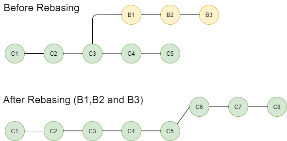
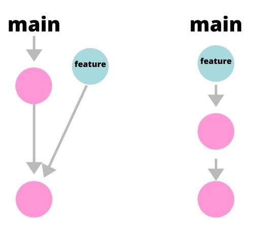
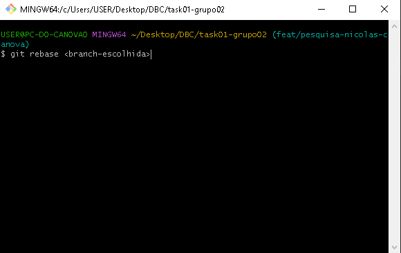
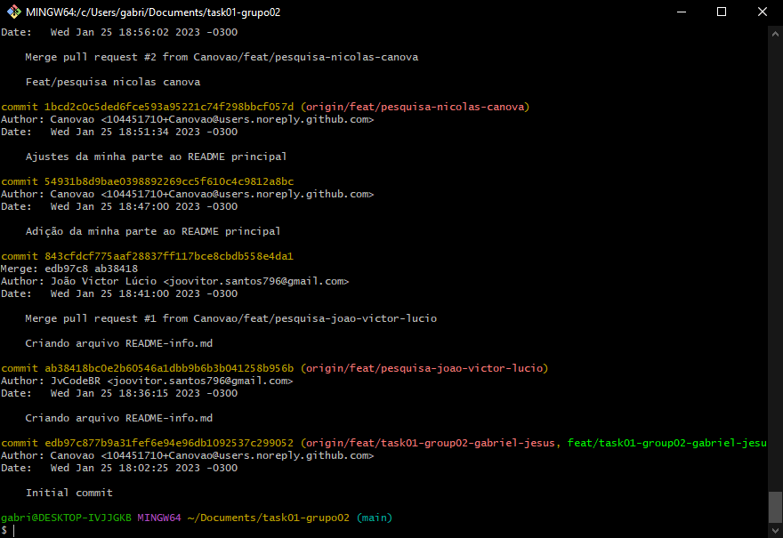
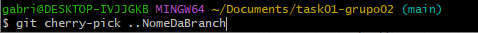
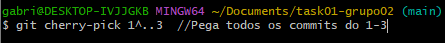

# task01-grupo02

## Git rebase

O git rebase é um comando Git usado no CLI do Git. Ele é usado para fazer o rebasing, processo de mover ou combinar uma sequência de commits para um commit base, é uma forma de alterar a uma branch da aplicação adicionando outra branch, como se você tivesse criado a ramificação a partir de um commit diferente. Dessa forma, o Git cria novos commits e os aplica à branch escolhida.

### Principais usos
O git rebase integra alterações de uma branch em outra e seu principal motivo para ser usado é para manter um histórico de projeto linear.
Com o git rebase também é possível juntar diversos commits em um único.

### Exemplos

* Um bug foi identificado na ramificação principal. Um recurso que estava funcionando bem agora está com falha, o desenvolvedor examina o histórico da ramificação principal usando git log, vê o que está errado, arruma e usa o git rebase para juntar a branch correta na incorreta.
* Criou uma branch para si a partir da branch principal, logo, a branch que você criou está atualizada. Mas, houve algum imprevisto e ficou sem desenvolver por um tempo e, consequentemente, sem atualizar a sua branch. O time atualizou a branch principal, logo, quando você for tentar subir as suas alterações para a branch principal, terá conflito.

## Git Cherry Pick

O git cherry pick é um comando que copia um commit específico de uma branch para outra.

### Principais usos
* Replicar um commit no branch atual, porém mantendo o commit original sem alterações.
* Projetos grandes onde há muitos desenvolvedores trabalhando no mesmo código. 

### Exemplos

* Há um commit que você deseja levar para outra ramificação, fazendo assim uma cópia.
* Procura pelo ID do commit que será copiado na sua respectiva branch.

* Há também a possíbilidade de pegar todos os commits da branch:

* Ou um intervalo de commits:
