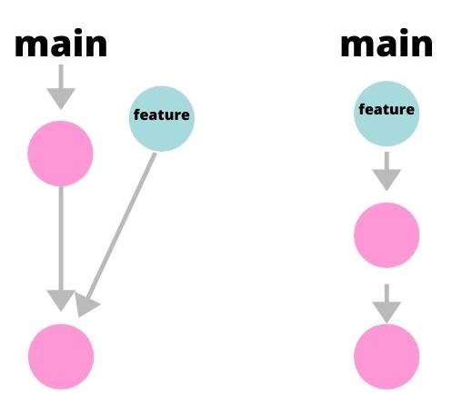
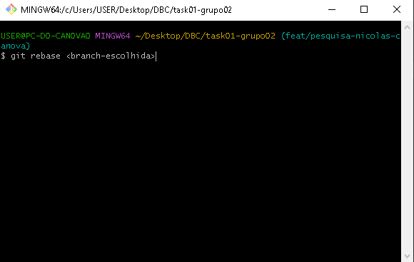
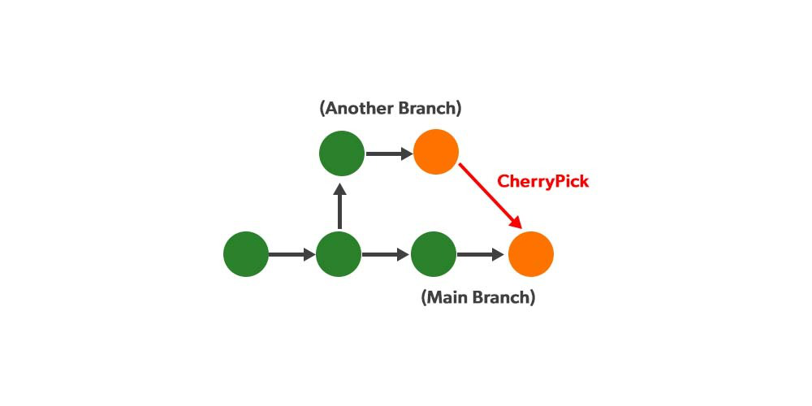
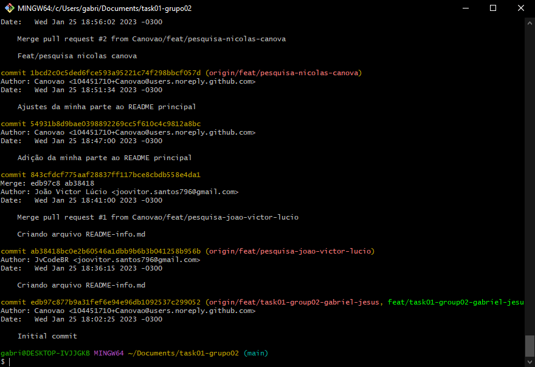
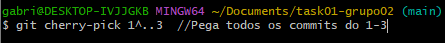
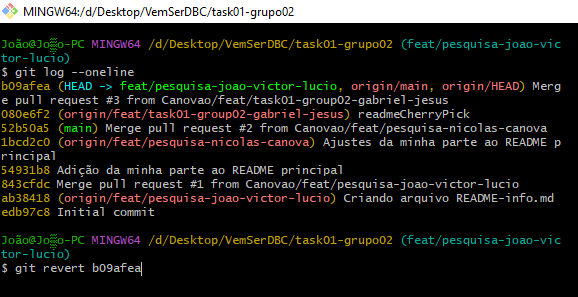

# task01-grupo02

## Git rebase

O git rebase é um comando Git usado no CLI do Git. Ele é usado para fazer o rebasing, processo de mover ou combinar uma sequência de commits para um commit base, é uma forma de alterar a uma branch da aplicação adicionando outra branch, como se você tivesse criado a ramificação a partir de um commit diferente. Dessa forma, o Git cria novos commits e os aplica à branch escolhida.


### Principais usos
O git rebase integra alterações de uma branch em outra e seu principal motivo para ser usado é para manter um histórico de projeto linear.
Com o git rebase também é possível juntar diversos commits em um único.


### Exemplos

* Um bug foi identificado na ramificação principal. Um recurso que estava funcionando bem agora está com falha, o desenvolvedor examina o histórico da ramificação principal usando git log, vê o que está errado, arruma e usa o git rebase para juntar a branch correta na incorreta.
* Criou uma branch para si a partir da branch principal, logo, a branch que você criou está atualizada. Mas, houve algum imprevisto e ficou sem desenvolver por um tempo e, consequentemente, sem atualizar a sua branch. O time atualizou a branch principal, logo, quando você for tentar subir as suas alterações para a branch principal, terá conflito.



## Git Cherry Pick

O git cherry pick é um comando que copia um commit específico de uma branch para outra.



### Principais usos
* Replicar um commit no branch atual, porém mantendo o commit original sem alterações.
* Projetos grandes onde há muitos desenvolvedores trabalhando no mesmo código. 

### Exemplos

* Há um commit que você deseja levar para outra ramificação, fazendo assim uma cópia.
* Procura pelo ID do commit que será copiado na sua respectiva branch.


* Há também a possíbilidade de pegar todos os commits da branch:


* Ou um intervalo de commits:<br>


## Git revert

Esse comando, resumidamente, desfaz tudo que foi alterado em um commit. O git faz isso criando um novo commit registrando o que foi desfeito, ou seja, o commit a ser revertido não é tecnicamente removido do histórico do projeto mas é gerado um novo commit com as alterações revertidas.

Sintaxe:



### Principal uso

*Desfazer as alterações realizadas por um commit.

### Exemplo

*Foi feito um commit com alterações na branch de produção que inviabilizam o funcionamento de uma aplicação e, devido a tal, precisa retornar ao estado anterior.

## Git squash

Comando do Git que agrupa commits em um único.

Sintaxe:

```
Git rebase -i <hash do commit anterior ao primeiro commit que será unificado>
```
Irá retornar um lista de commits para ser escolhida a ação a ser realizada com os mesmo. Neste caso iremos utilizar o parâmetro Squash.
```
pick c00b49a
squash 62f64bl
squash 9b44a27
```
Os commits com o parâmetro squash serão agrupados no que está com o parâmetro pick.

## Principal uso

*O Squash é utilizado para melhorar o histórico do Git.

## Exemplo

*O histórico do Git está muito poluído com commits de pequenas alterações, então se utiliza o Squash para agrupá-los afim de mostrar apenas os commits mais recentes e relevantes.